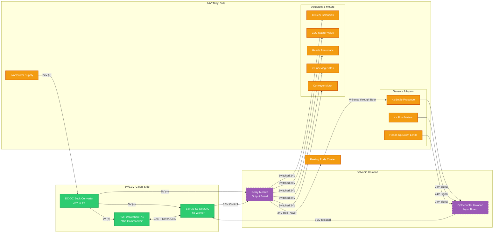

# ⚙️ 4-Head Bottle Filler - Hardware Specification v1.0

This document outlines the electrical and electronic architecture of the 4-head bottling machine. The system is designed with a strict "Moat" architecture, separating the high-power **Dirty Side** from the logic-level **Clean Side** using optical and magnetic isolation to ensure maximum reliability in an industrial environment.

---

## 1. System Architecture Overview

The machine is split into two distinct voltage domains:
*   🔴 **24V "Dirty" Side:** Handles the heavy lifting (solenoids, relays, industrial sensors).
*   🟢 **3.3V/5V "Clean" Side:** Handles the logic, state machine, and HMI.

Isolation is achieved via:
1.  **Optical Isolation:** Optocoupler boards for all 24V inputs.
2.  **Magnetic Isolation:** Relay coils for all 24V outputs.
3.  **Physical Separation:** DC-DC buck conversion with filtered grounding.

---

## 2. Power Delivery System

| Component | Description | Function |
| :--- | :--- | :--- |
| **24V DC PSU** | Industrial DIN-rail power supply. | Main power source for sensors, solenoids, and relays. |
| **DC-DC Buck Converter** | 24V to 5V Step-down. | Provides stable 5V power to the ESP32 logic and relay coils. |
| **Linear Regulator (On-board)** | ESP32-S3 built-in LDO. | Steps 5V down to 3.3V for internal logic and GPIOs. |

---

## 3. The Brains & Communication

The system utilizes a dual-processor architecture to separate the User Interface from the Real-Time Control.

### 🎮 The Commander (HMI)
*   **Hardware:** Waveshare 7.0" ESP32-S3 Touchscreen.
*   **Role:** Runs the LVGL-based GUI, handles operator inputs, displays telemetry, and manages machine recipes.
*   **Location:** Mounted on the front of the electrical enclosure.

### 🧠 The Worker (PLC-Lite)
*   **Hardware:** ESP32-S3 DevKitC.
*   **Role:** Executes the real-time state machine, monitors sensors via interrupts, and triggers actuators.
*   **Location:** Mounted inside the control box on a DIN rail.

### 🖇️ The Link
*   **Protocol:** UART (TTL 3.3V).
*   **Physical:** 3-wire connection (TX, RX, Shared GND).
*   **Traffic:** Lightweight ASCII command strings (e.g., `<START>`, `<VLV1,ON>`, `<TELEM,215,330>`).

---

## 4. The Inputs (Sensors & Switches)

All 24V signals are stepped down to 3.3V via optocouplers before hitting the Worker ESP32.

| Input Type | Qty | Wiring | Function |
| :--- | :---: | :--- | :--- |
| **Bottle Presence** | 4 | 24V NPN NO (Optical) | Detects if a bottle is positioned under a fill head. |
| **Feeling Rods** | 4 | 24V Sensing (Optical) | Detects beer level when liquid closes circuit between rod and filler tube. |
| **Mechanical Limits**| 2 | 3.3V Dry Contact | Confirms "Heads Up" and "Heads Down" pneumatic positions. |

**Total Inputs: 10**

---

## 5. The Outputs (Actuators & Motors)

The Worker ESP32 triggers 3.3V signals to a relay board, which switches 24V to the field devices.

| Output Type | Qty | Wiring | Function |
| :--- | :---: | :--- | :--- |
| **Angle Seat Valves** | 4 | 24V DC (Pneumatic) | Controls the beer path using robust industrial angle seat valves. |
| **CO2 Master Valve** | 1 | 24V DC | Flushes bottles with CO2 before filling. |
| **Rod Power Relay** | 1 | 24V DC | Provides 24V to the feeling rods during the filling phase. |
| **Heads Pneumatic** | 1 | 24V DC (5/2 Valve) | Controls the air cylinder to lift/lower the fill heads. |
| **Entry Indexing Gate**| 1 | 24V DC (3/2 Valve) | Blocks incoming bottles once the filling area is full. |
| **Exit Indexing Gate** | 1 | 24V DC (3/2 Valve) | Holds bottles during filling; releases them onto the capping belt. |
| **Conveyor Motor** | 1 | 24V Relay | Transports bottles through the machine. |

**Total Outputs: 8**

---

## 6. Pin Usage & Final Tally

*   **Logic Pins:** 20 (10 Inputs + 10 Outputs)
*   **Comm Pins:** 2 (UART TX/RX)
*   **Total GPIOs:** 22 / 24 available.

The ESP32-S3 DevKitC provides ample I/O for this architecture without requiring I2C expanders, ensuring low-latency response for flow meter pulses.

---

## 7. Electrical Block Diagram

